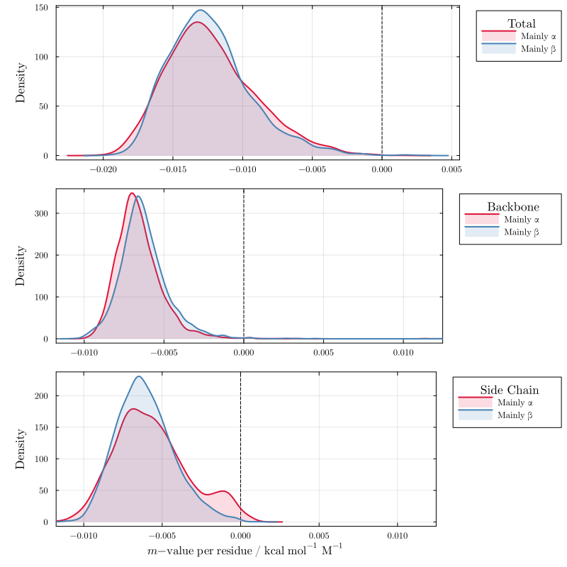
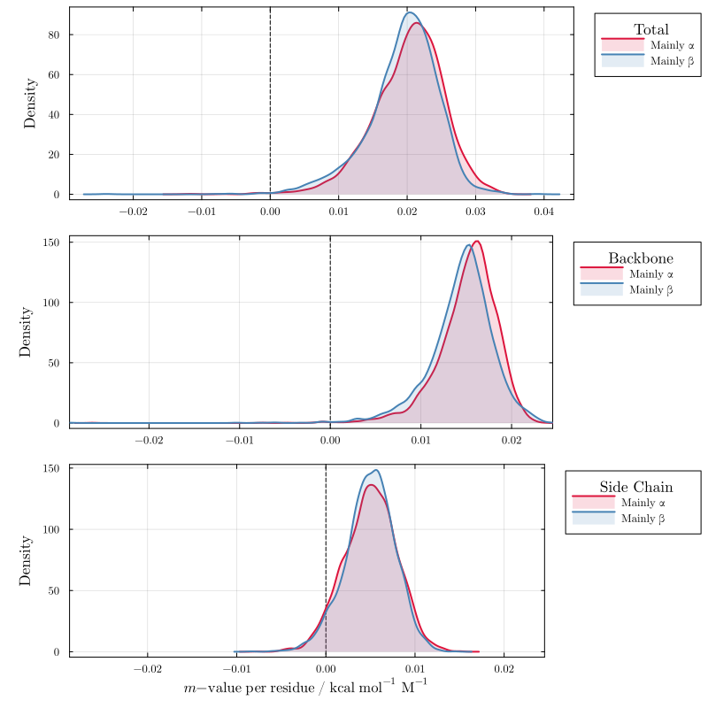
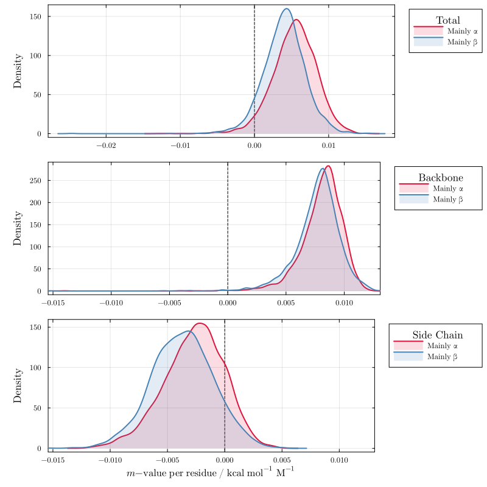
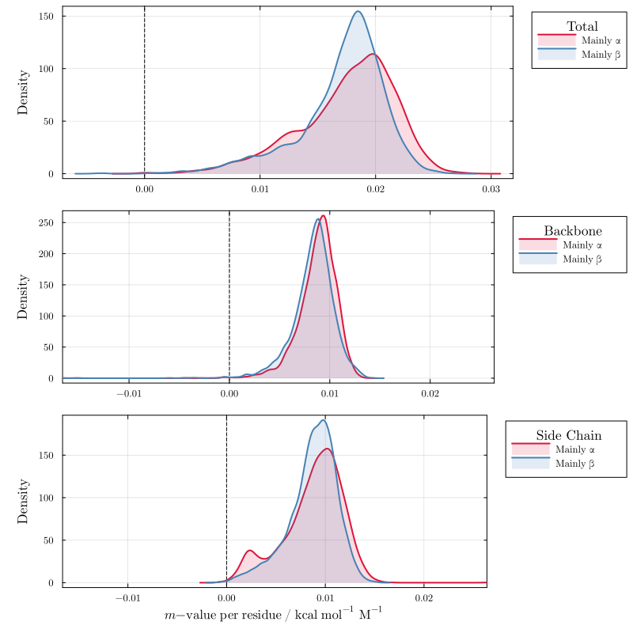
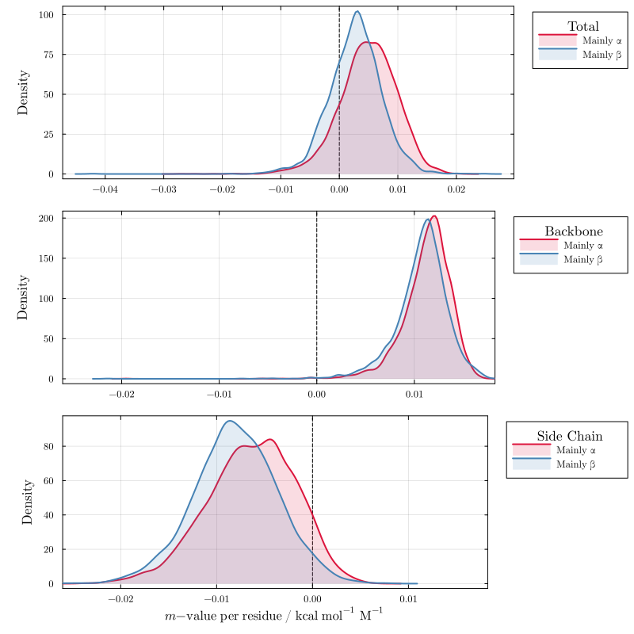
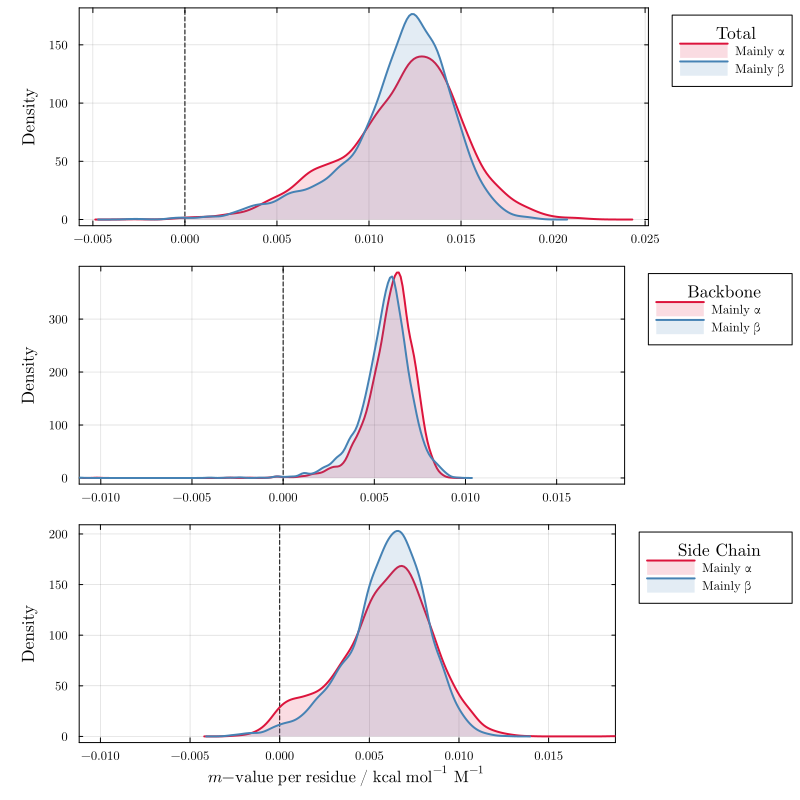
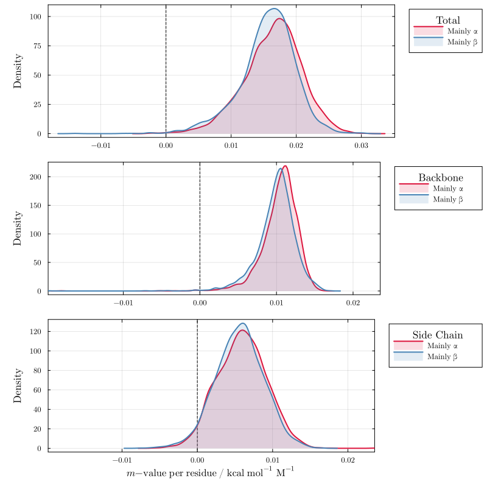
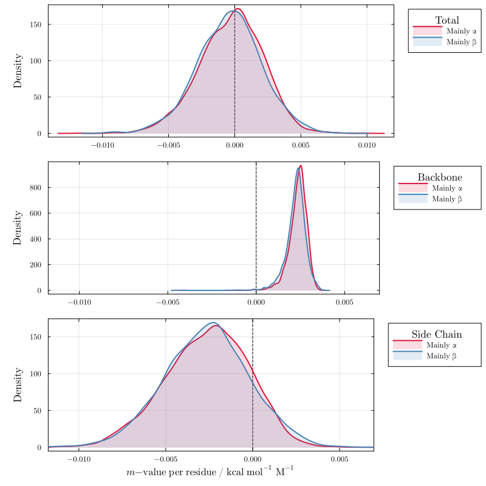
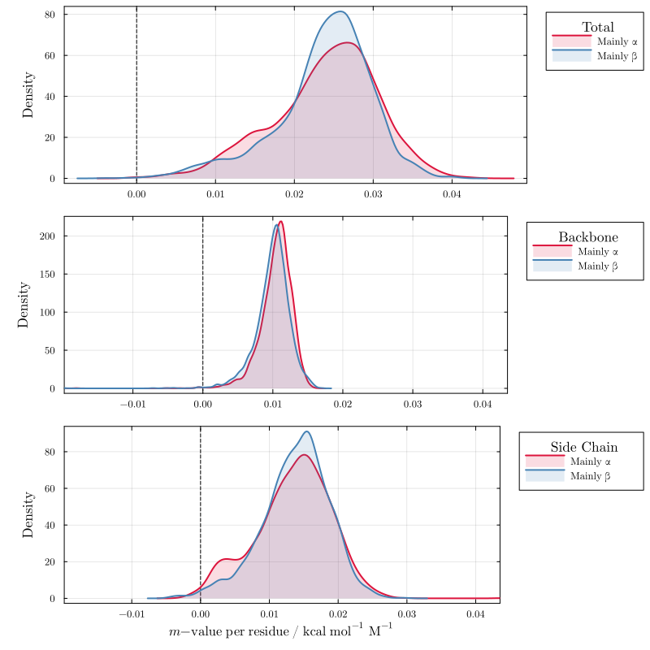

# Relation to secondary structure

Using the `MoeserHorinekFit` model, these plots show the distribution of total, backbone, and side-chain m-value contributions per residue across the full set of non-homologous proteins from the CATH-S20 database (~15k domains), classified into mainly-α (3936 models) and mainly-β (3131 models) folds. The analysis reveals that urea interacts similarly with both fold classes, while proline shows an asymmetry in side-chain interactions that leads to stronger favorable interactions with β-folds than with helical structures. These results correspond to Figure 7 of the paper.

```julia
using LAPM
import DataFrames, CSV
df = CSV.read(cath_data_file, DataFrames.DataFrame);
```

## Urea — Figure S40

```julia
plot_cosolvent(df, "urea")
```



## TMAO — Figure S41

```julia
plot_cosolvent(df, "tmao")
```



## Proline — Figure S42

```julia
plot_cosolvent(df, "proline")
```



## Sarcosine — Figure S43

```julia
plot_cosolvent(df, "sarcosine")
```



## Betaine — Figure S44

```julia
plot_cosolvent(df, "betaine")
```



## Sorbitol — Figure S45

```julia
plot_cosolvent(df, "sorbitol")
```



## Sucrose — Figure S46

```julia
plot_cosolvent(df, "sucrose")
```



## Glycerol — Figure S47

```julia
plot_cosolvent(df, "glycerol")
```



## Trehalose — Figure S48

```julia
plot_cosolvent(df, "trehalose")
```


