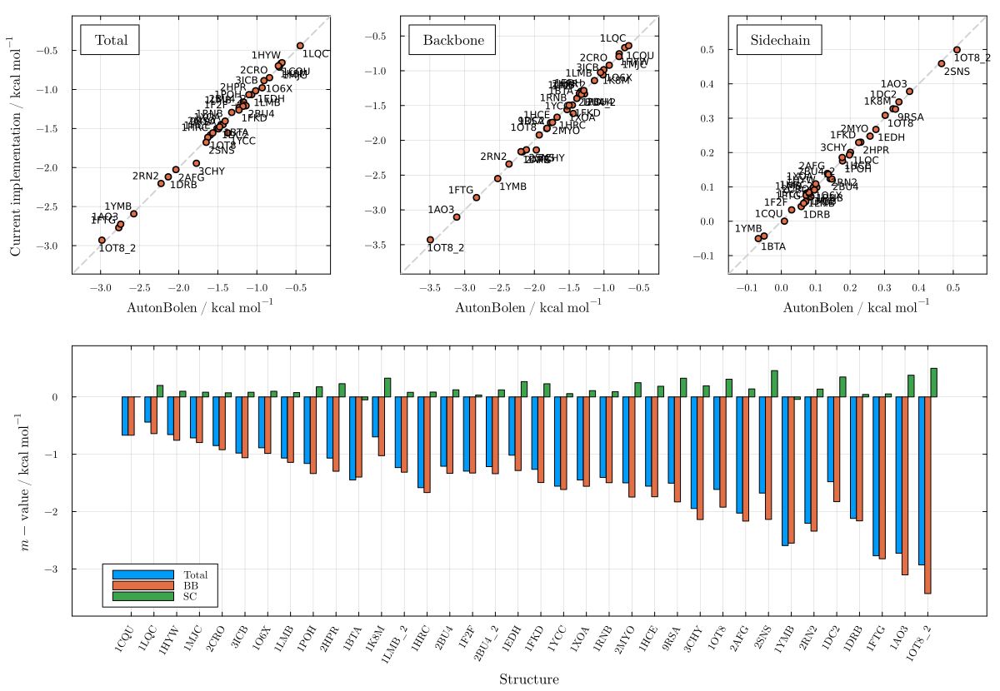
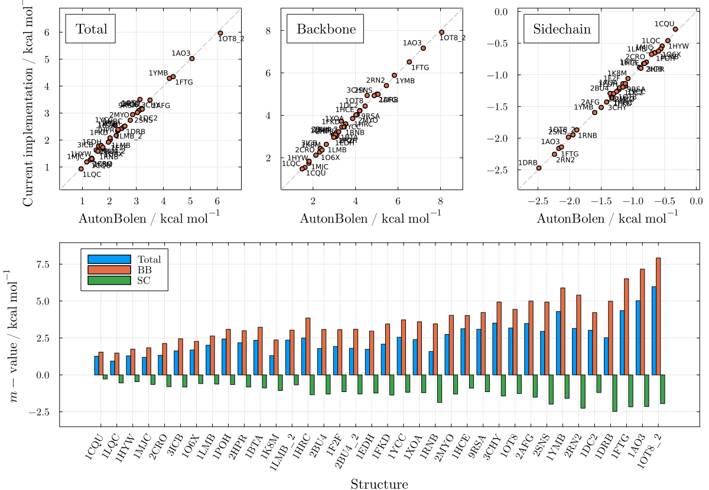
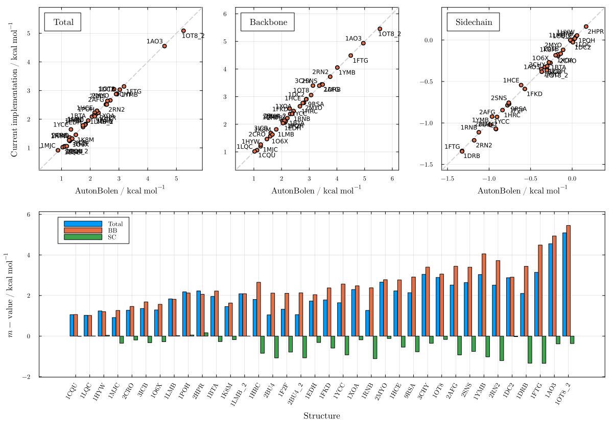
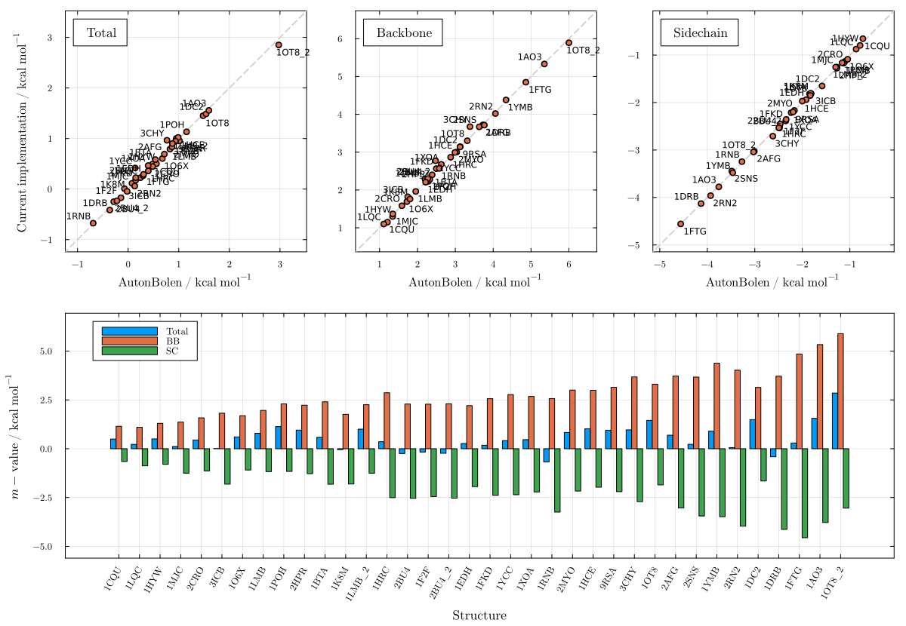
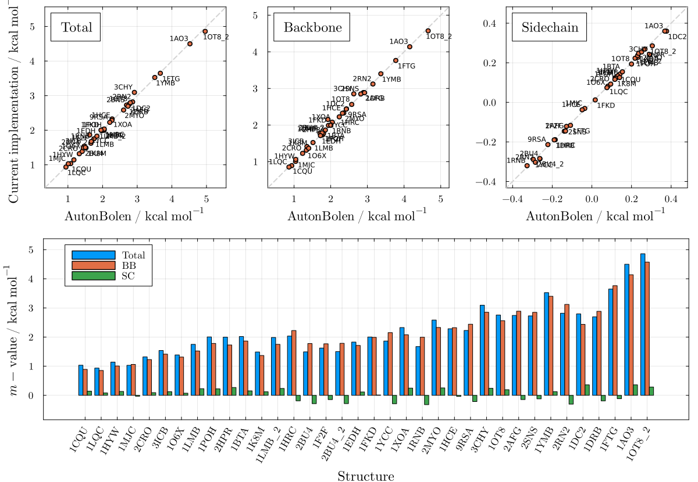
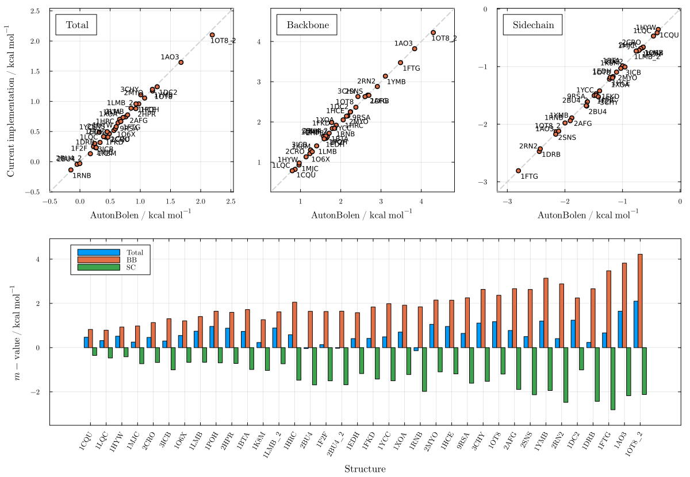
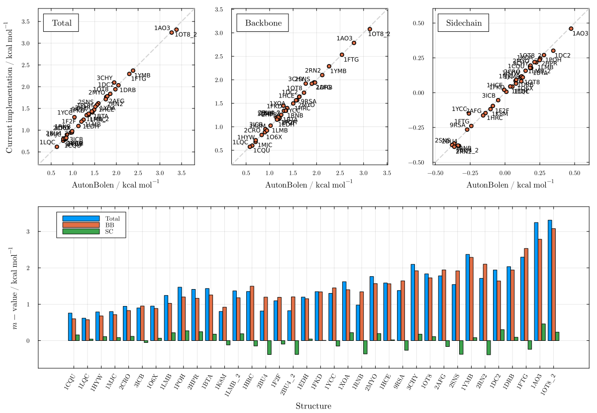
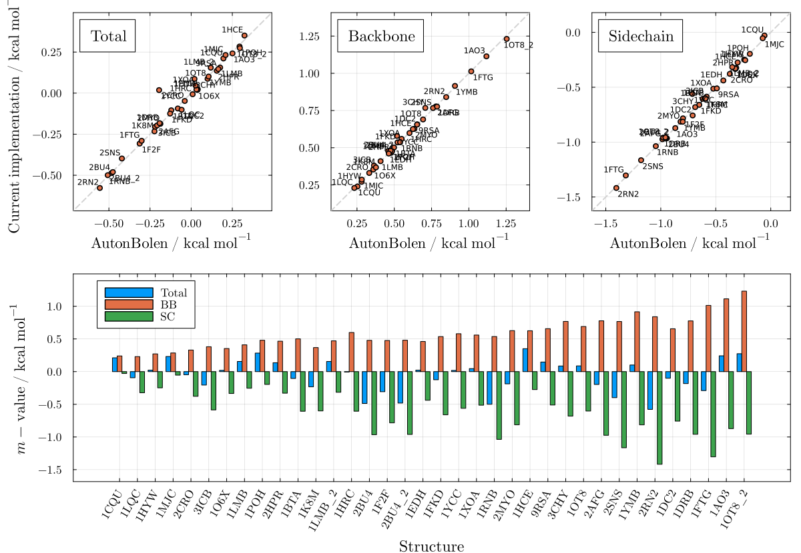
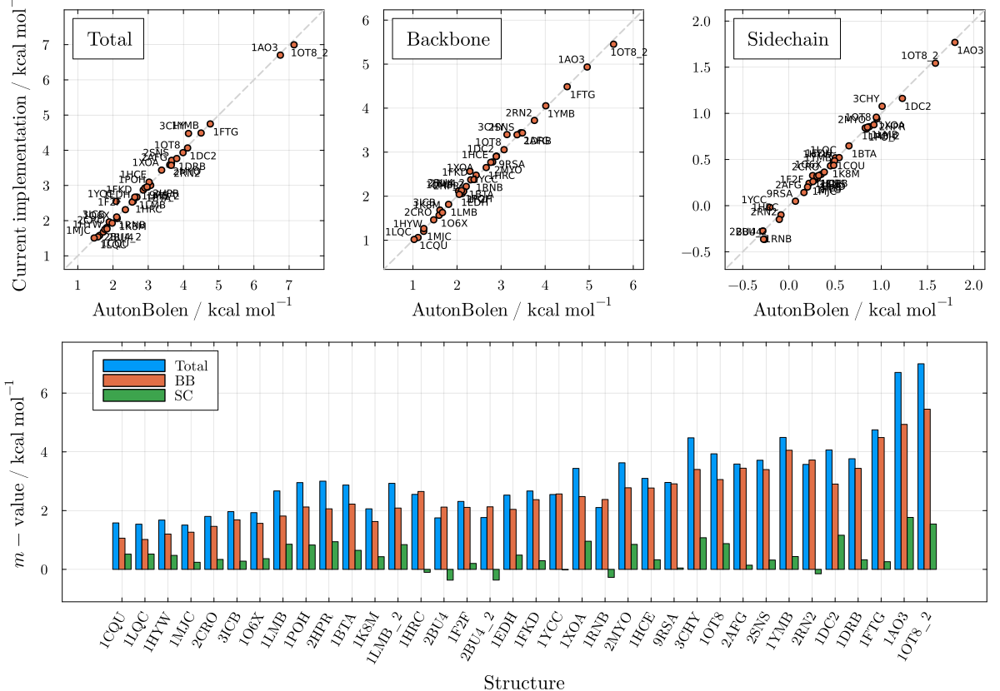

# Auton & Bolen (Creamer SASAs)

These plots validate the AutonBolen m-value predictions computed with Creamer denatured-state SASAs against those obtained from the AB server, for all nine cosolvents. The excellent agreement (R² ≈ 1) shown here corresponds to Figure 1 of the paper, confirming that the reparameterized Creamer model is a reliable surrogate for the server SASA across all cosolvents.

```julia
using LAPM
```

## Urea — Figure S10

```julia
plot_mvalue(AutonBolen, "urea")
```



## TMAO — Figure S11

```julia
plot_mvalue(AutonBolen, "tmao")
```



## Sucrose — Figure S12

```julia
plot_mvalue(AutonBolen, "sucrose")
```



## Betaine — Figure S13

```julia
plot_mvalue(AutonBolen, "betaine")
```



## Sarcosine — Figure S14

```julia
plot_mvalue(AutonBolen, "sarcosine")
```



## Proline — Figure S15

```julia
plot_mvalue(AutonBolen, "proline")
```



## Sorbitol — Figure S16

```julia
plot_mvalue(AutonBolen, "sorbitol")
```



## Glycerol — Figure S17

```julia
plot_mvalue(AutonBolen, "glycerol")
```



## Trehalose — Figure S18

```julia
plot_mvalue(AutonBolen, "trehalose")
```


