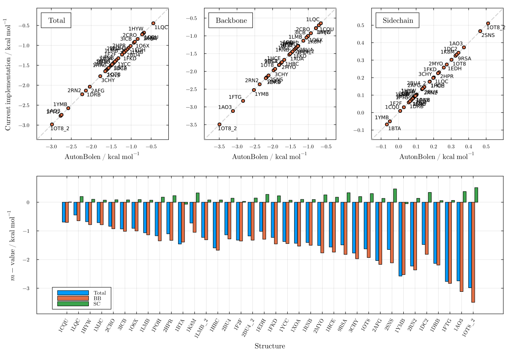
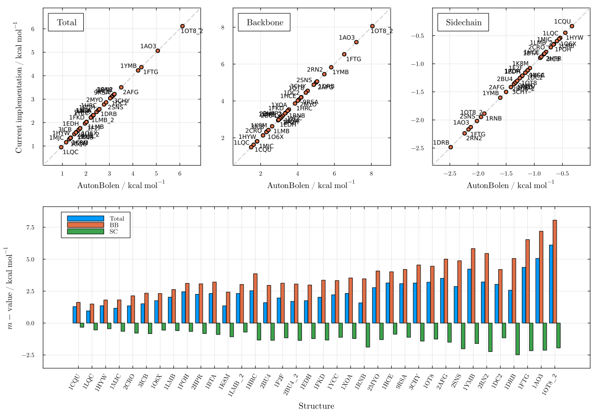
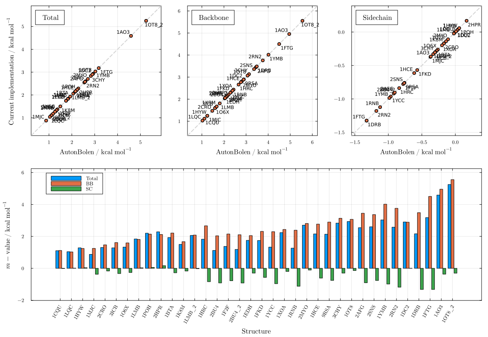
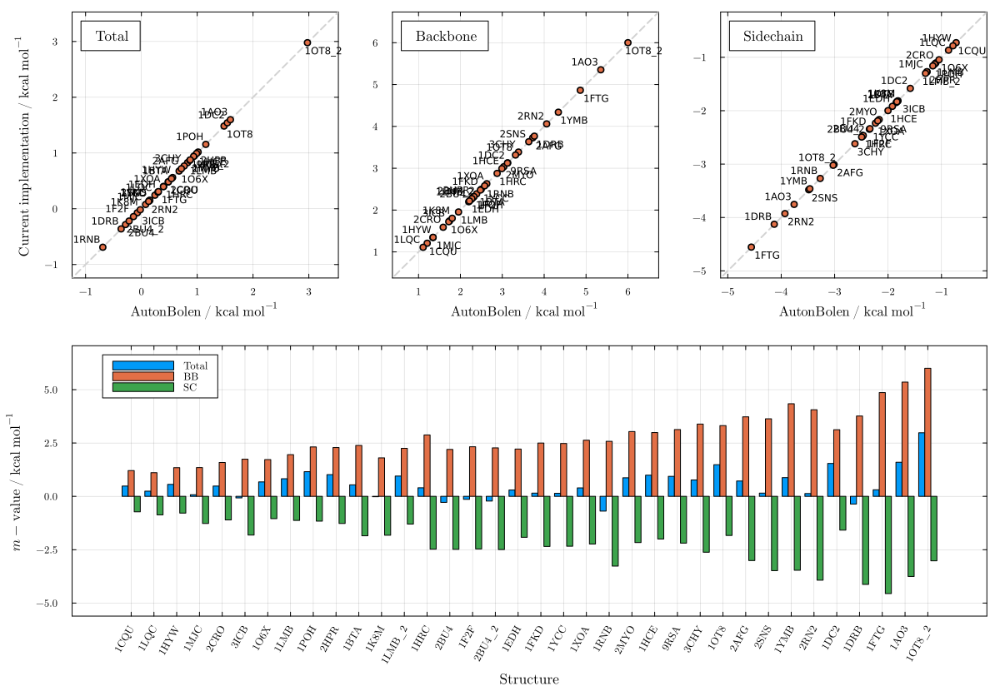
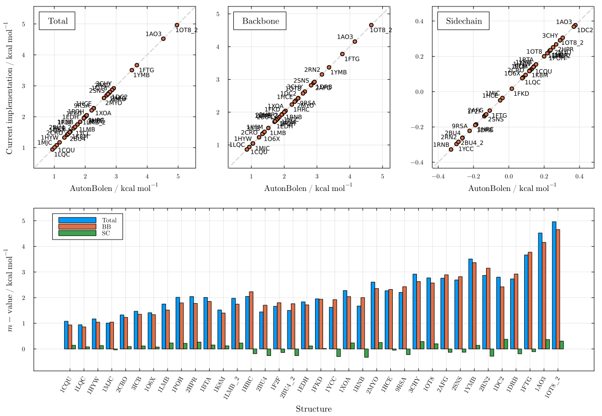
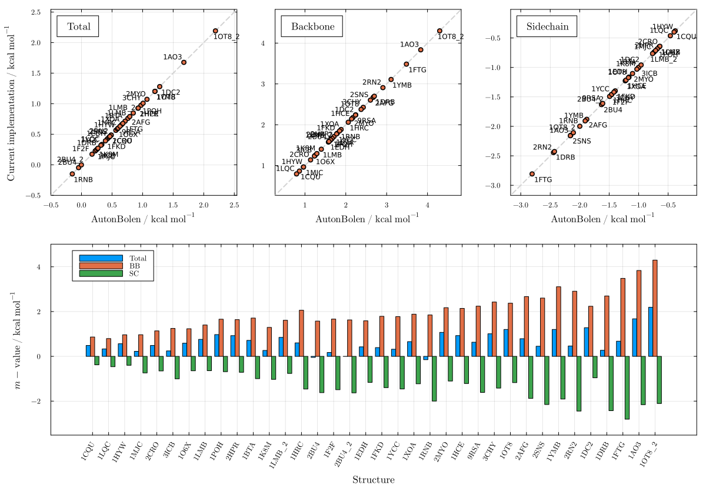
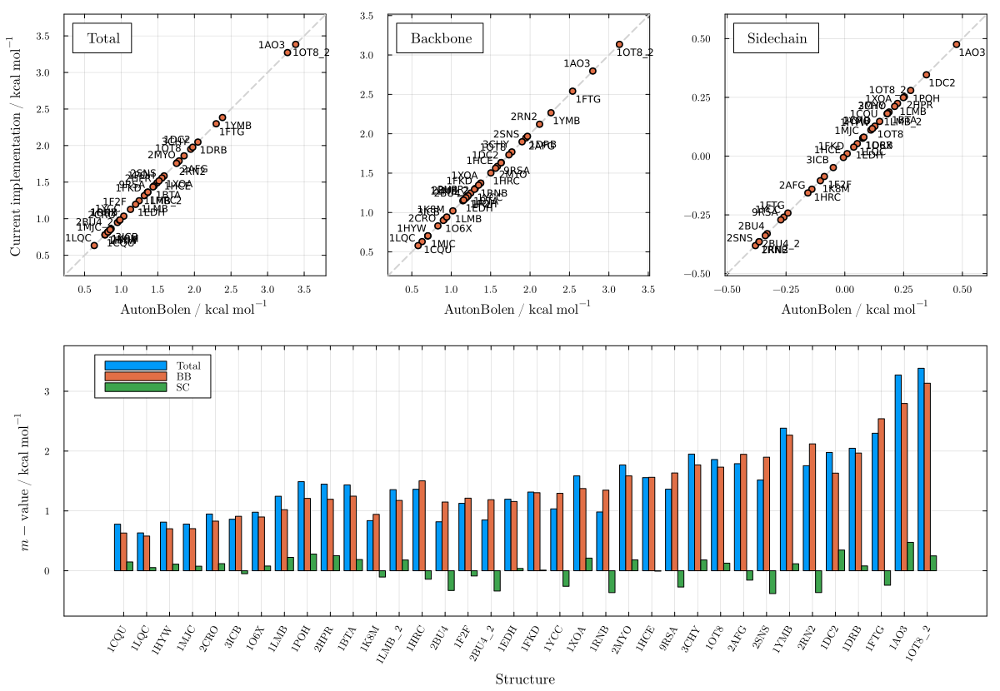
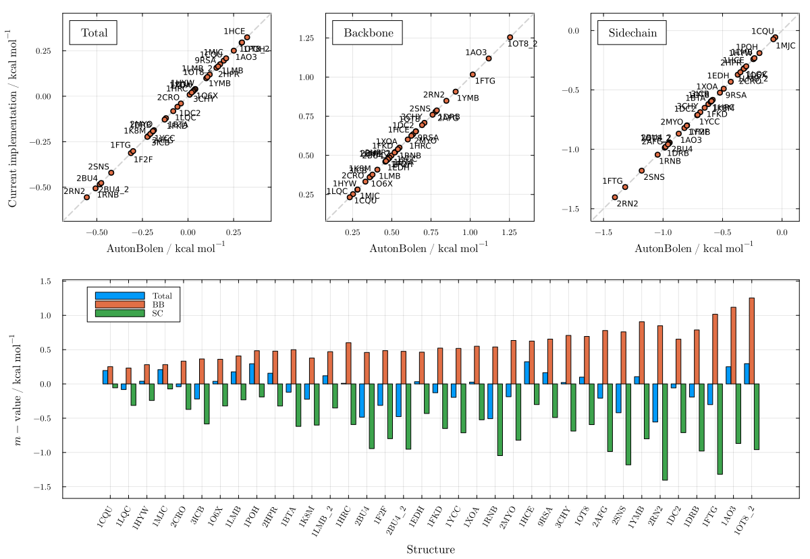
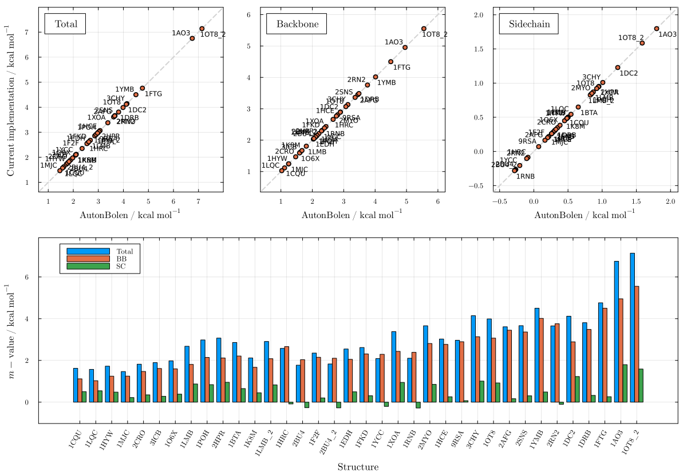

# Auton & Bolen (Server SASAs)

These plots show AutonBolen m-value predictions computed using the SASA values obtained directly from the AB server, compared against the server's own m-value outputs. Agreement is essentially exact for all seven cosolvents (R² ≈ 1), confirming that the group transfer free energy parameters and SASA decomposition are correctly implemented in PDBTools.jl.

```julia
using LAPM
```

## Urea — Figure S17

```julia
plot_mvalue(AutonBolen, "urea"; sasas_from=LAPM.server_sasa)
```



## TMAO — Figure S18

```julia
plot_mvalue(AutonBolen, "tmao"; sasas_from=LAPM.server_sasa)
```



## Sucrose — Figure S19

```julia
plot_mvalue(AutonBolen, "sucrose"; sasas_from=LAPM.server_sasa)
```



## Betaine — Figure S20

```julia
plot_mvalue(AutonBolen, "betaine"; sasas_from=LAPM.server_sasa)
```



## Sarcosine — Figure S21

```julia
plot_mvalue(AutonBolen, "sarcosine"; sasas_from=LAPM.server_sasa)
```



## Proline — Figure S22

```julia
plot_mvalue(AutonBolen, "proline"; sasas_from=LAPM.server_sasa)
```



## Sorbitol — Figure S23

```julia
plot_mvalue(AutonBolen, "sorbitol"; sasas_from=LAPM.server_sasa)
```



## Glycerol — Figure S24

```julia
plot_mvalue(AutonBolen, "glycerol"; sasas_from=LAPM.server_sasa)
```



## Trehalose — Figure S25

```julia
plot_mvalue(AutonBolen, "trehalose"; sasas_from=LAPM.server_sasa)
```


