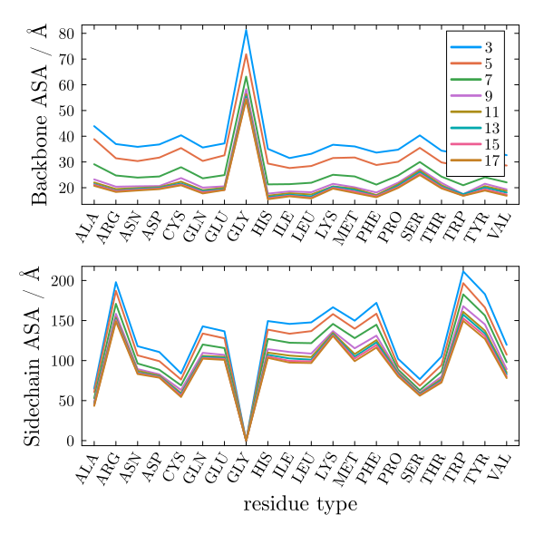
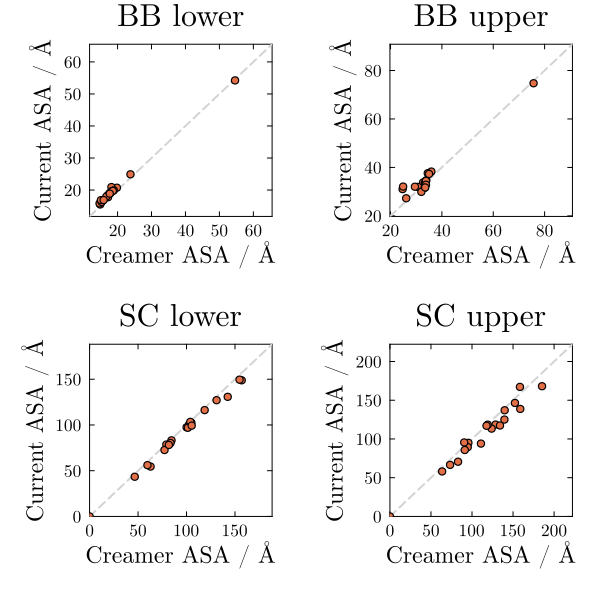
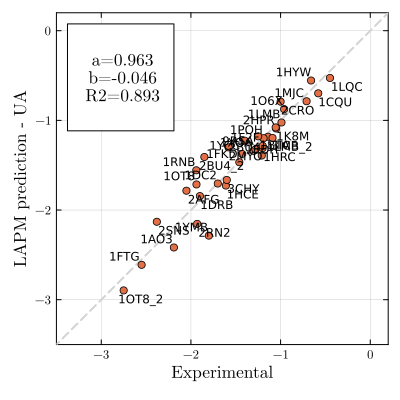
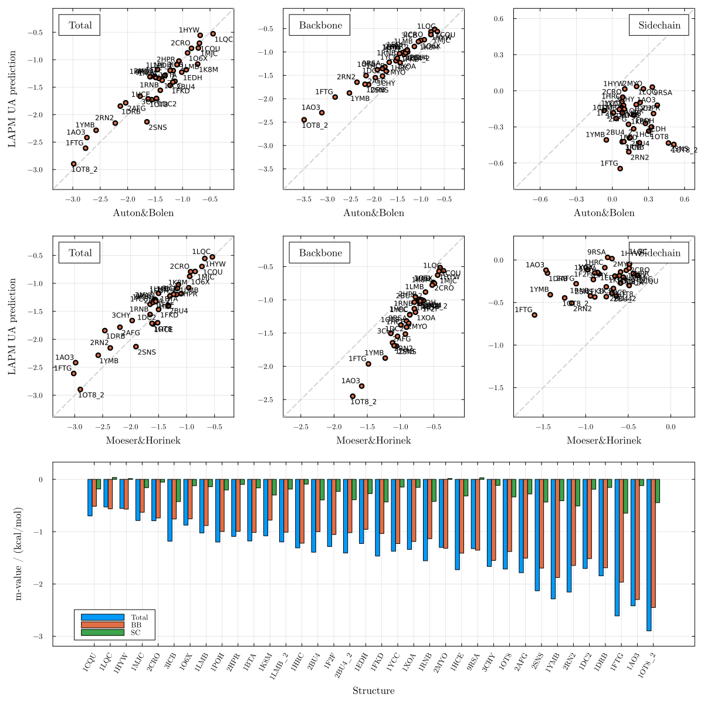

# Reproduction of Creamer ASA

This section validates the from-scratch reproduction of the Creamer denatured-state SASA model. The Creamer model estimates backbone and side-chain SASAs of a central residue by extracting overlapping fragments of five consecutive residues from folded protein structures, computing the average over all occurrences of each residue type in both as-found and extended conformations. Agreement between our computed values and Creamer's published backbone and side-chain lower and upper bounds validates both the fragment extraction procedure and the SASA implementation (Supplementary Figures S4 and S5 of the paper).

## Figure S4: Backbone SASA per fragment length



## Figure S5: Backbone and side-chain SASA comparison with Creamer



## Using the parameterized united atom model

### For a single structure:

```julia
using LAPM, PDBTools
pdb = read_pdb(LAPM.pdb_files["1AO3"], "protein and not element H")
LAPM.mvalue_ua(pdb)
```

### All results vs. experimental values — Figure S6

```julia
LAPM.plot_ua()
```



### All results vs. other models — Figure S7

```julia
LAPM.plot_mvalue_ua()
```


