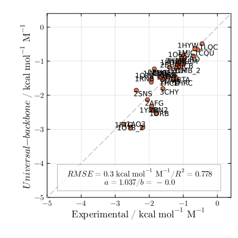
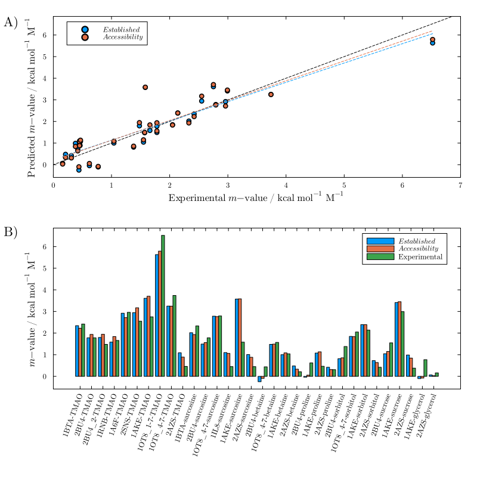
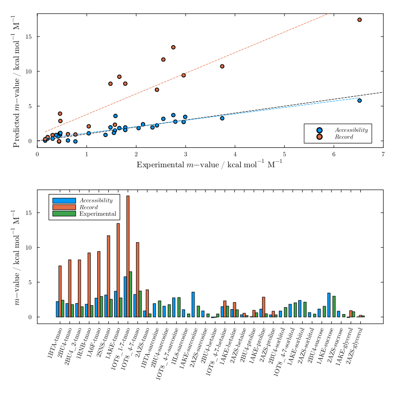
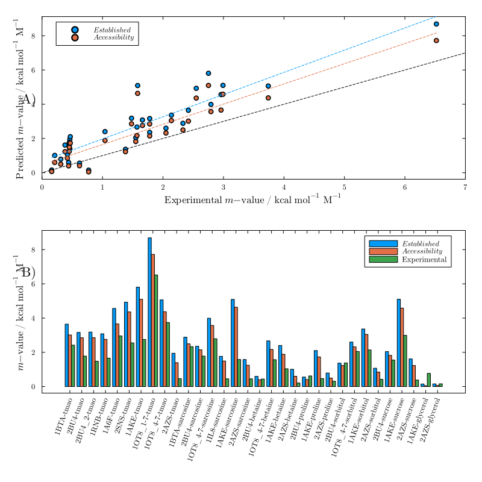
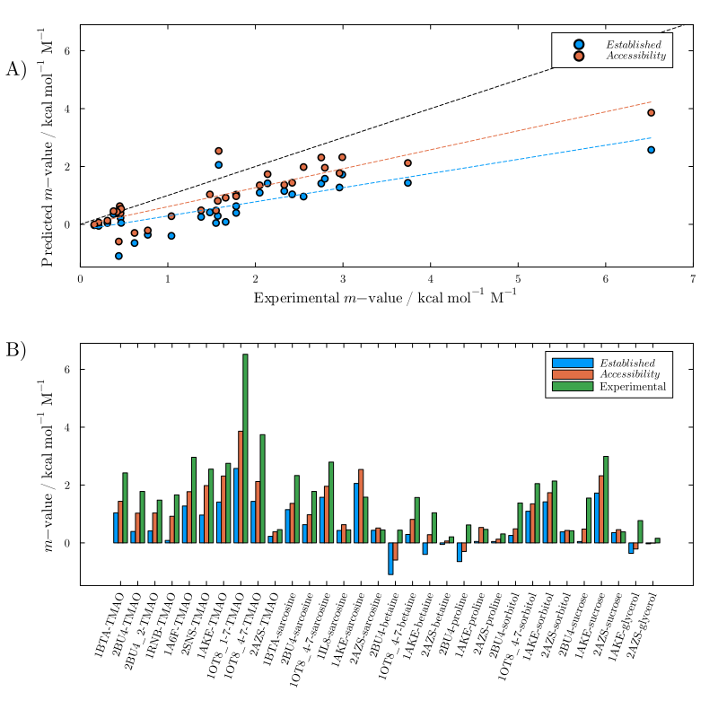
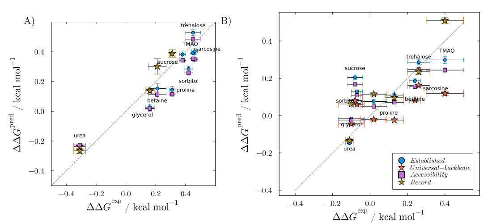
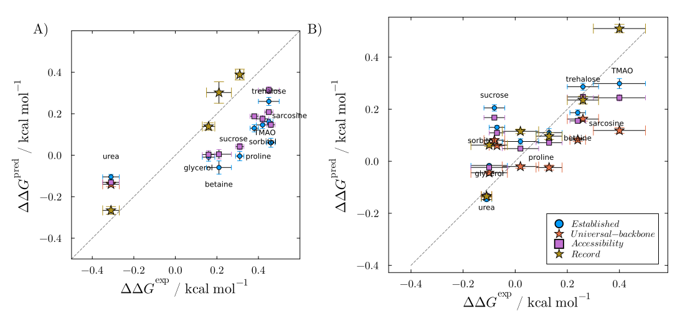

# Experimental

These plots benchmark model predictions against experimental m-values. The urea sections (Figures 4 and 5 of the paper) compare MH, AB, and Accessibility predictions against a 36-protein test set, showing that all models correlate well with experiment (slopes within ~15% of unity). The other-osmolyte section validates the AB and Accessibility models against experimental data for the full set of AB cosolvents. The SH3/GB1 section (Figure 6) compares predictions against the Rydeen et al. (2018) dataset for SH3 unfolding and GB1 dimer dissociation.

```julia
using LAPM
```

## Urea (Creamer)

### MoeserHorinek — Figure S53

```julia
plot_experimental(MoeserHorinek; sasas_from=LAPM.creamer_sasa)
```


### AutonBolen — Figure S54

```julia
plot_experimental(AutonBolen; sasas_from=LAPM.creamer_sasa)
```


## Urea (Server)

### MoeserHorinek — Figure S55

```julia
plot_experimental(MoeserHorinek; sasas_from=LAPM.server_sasa)
```



### AutonBolen — Figure S56

```julia
plot_experimental(AutonBolen; sasas_from=LAPM.server_sasa)
```


## Urea (Record model)

Using default `type=3` and `alpha=1.15` to estimate the denatured model ASAs.

```julia
plot_experimental(MTRecord, "urea")
```


## Other osmolytes

### Using mean denatured Creamer model — Figure S58

```julia
other_osmolytes(; type=2)
```



### Using Record model (only for betaine) — Figure S59

```julia
other_osmolytes(; m1=Accessibility, m2=MTRecord)
```



Using `alpha=0.80` to empirically better adjust the two main points — Figure S60:

```julia
other_osmolytes(; m1=Accessibility, m2=MTRecord, alpha=0.80)
```


### Using maximally denatured Creamer model — Figure S61

```julia
other_osmolytes(; type=3)
```



### Using minimally denatured Creamer model — Figure S62

```julia
other_osmolytes(; type=1)
```



## SH3 and GB1 — Pielak data

Panel A is for unfolding of SH3, panel B for the dissociation of the GB1 dimer.

```julia
using PDBTools
using LAPM: os_pdb_files
```

### Using mean unfolded Creamer model — Figure S63

```julia
plt1 = plot_rydeen_folding(read_pdb(os_pdb_files["2AZS"]); type=2)
plt2 = plot_rydeen_dimmer(read_pdb(os_pdb_files["2RMM"]))
plot_rydeen_both(plt1, plt2)
```



### Using maximally unfolded Creamer model — Figure S64

```julia
plt1 = plot_rydeen_folding(read_pdb(os_pdb_files["2AZS"]); type=3)
plt2 = plot_rydeen_dimmer(read_pdb(os_pdb_files["2RMM"]))
plot_rydeen_both(plt1, plt2)
```


### Using minimally unfolded Creamer model — Figure S65

```julia
plt1 = plot_rydeen_folding(read_pdb(os_pdb_files["2AZS"]); type=1)
plt2 = plot_rydeen_dimmer(read_pdb(os_pdb_files["2RMM"]))
plot_rydeen_both(plt1, plt2)
```



### Using mean unfolded Creamer model and alpha=0.8 for Record — Figure S66

```julia
plt1 = plot_rydeen_folding(read_pdb(os_pdb_files["2AZS"]); type=2, alpha=0.8)
plt2 = plot_rydeen_dimmer(read_pdb(os_pdb_files["2RMM"]))
plot_rydeen_both(plt1, plt2)
```

