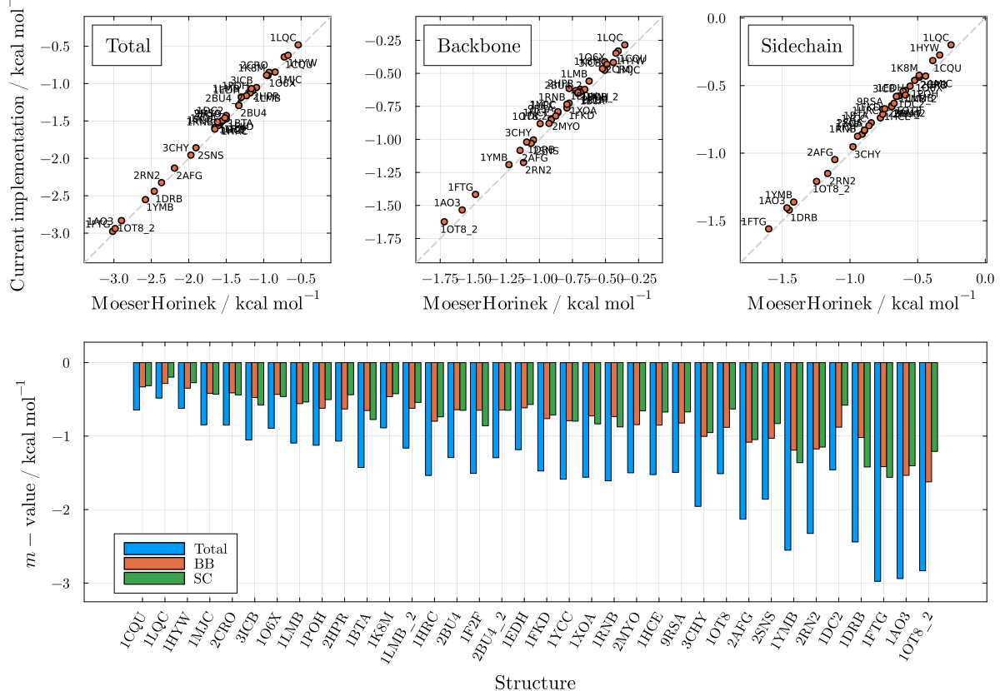
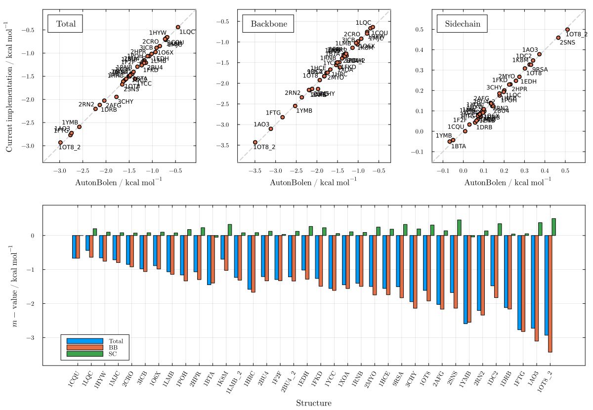
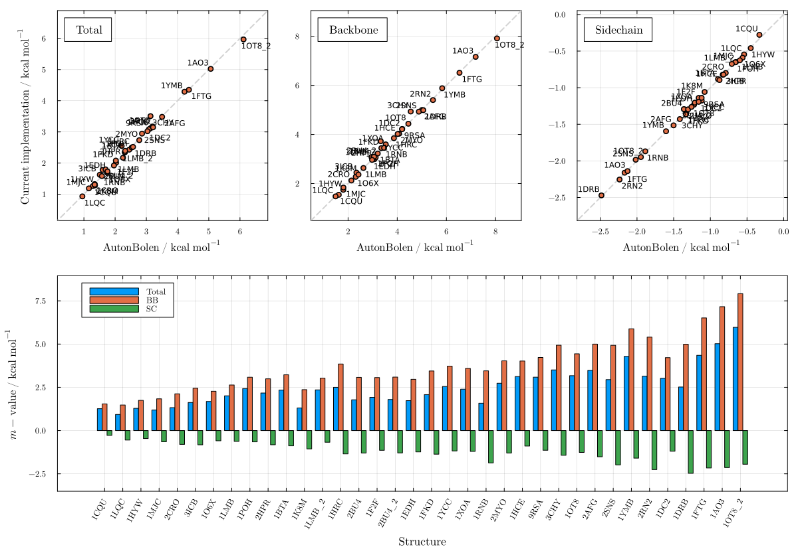

# Introduction

This repository ([LAPM.jl](https://github.com/m3g/LAPM.jl)) is the supplementary information package for the paper *"Osmolyte Effects on Protein Conformations: Self-contained, Free, Fast Implementations of Additive Transfer Models with Novel Glycine-Activity Corrections for Multi-Cosolvent Predictions"* (Lima et al., 2026). It contains the validation scripts, reference datasets, and analysis code used to benchmark the implementations of the Auton–Bolen (AB), Moeser–Horinek (MH), and MoeserHorinekApp models available in [PDBTools.jl](https://m3g.github.io/PDBTools.jl).

## Installation

```julia
using LAPM
```

The package will be downloaded at the `.julia/dev/` folder, and the files
can then be edited there.

## Examples

### Moeser & Horinek: Urea — Figure S1

Compute and compare predictions with the Moeser & Horinek model, for urea:

```julia
plot_mvalue(MoeserHorinek, "urea")
```



### Auton & Bolen: Urea — Figure S2

Plot comparison with Auton & Bolen, for urea:

```julia
plot_mvalue(AutonBolen, "urea")
```



### Auton & Bolen: TMAO — Figure S3

Plot comparison with Auton & Bolen, for another solvent (TMAO):

```julia
plot_mvalue(AutonBolen, "tmao")
```


