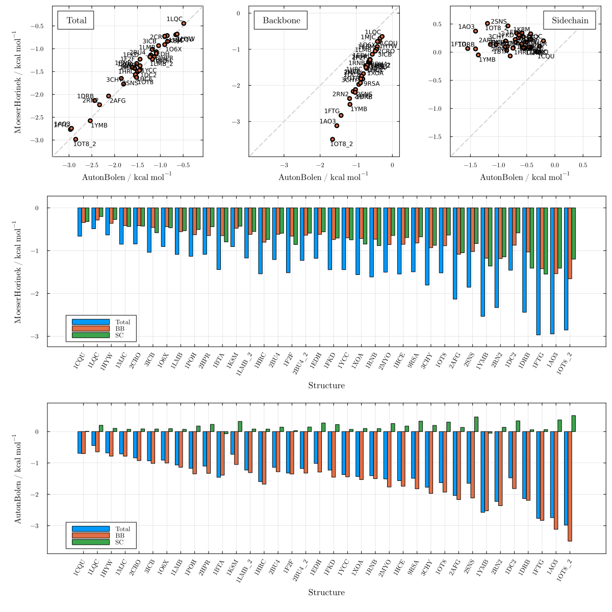
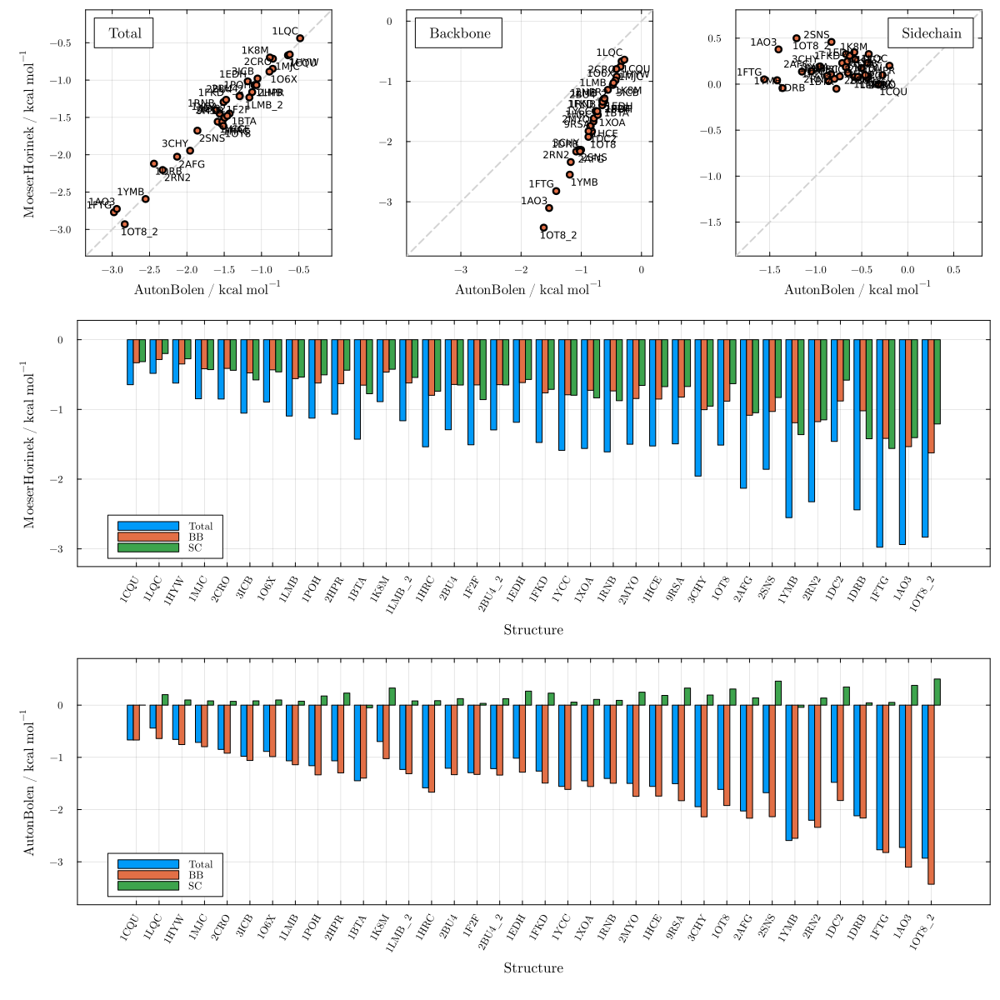

# Moeser & Horinek vs Auton & Bolen

These plots compare the total, backbone, and side-chain m-value predictions of the MH and AB models for 36 protein structures in urea. Although total m-values agree well (R² ≈ 1), the backbone/side-chain decomposition differs substantially between the two models: AB predicts systematically larger absolute backbone contributions than MH, while the MH glycine-activity correction shifts all side-chain transfer free energies to partially compensate. This difference is consequential when using the backbone/side-chain decomposition to interpret the structural determinants of cosolvent sensitivity, and corresponds to Figure 2 of the paper.

```julia
using LAPM
```

## Urea (Server) — Figure S28

```julia
plot_MH_vs_AB("urea"; sasas_from=LAPM.server_sasa)
```



## Urea (Creamer) — Figure S29

```julia
plot_MH_vs_AB("urea"; sasas_from=LAPM.creamer_sasa)
```


