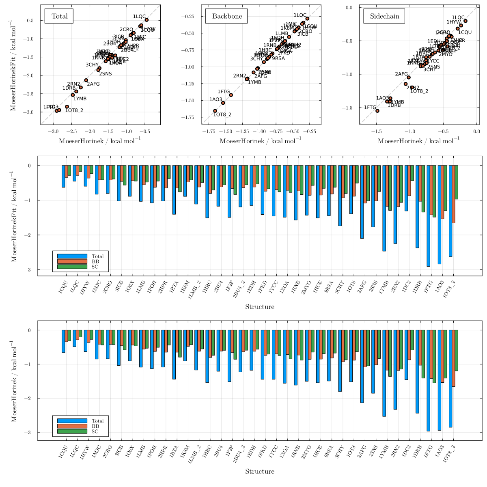
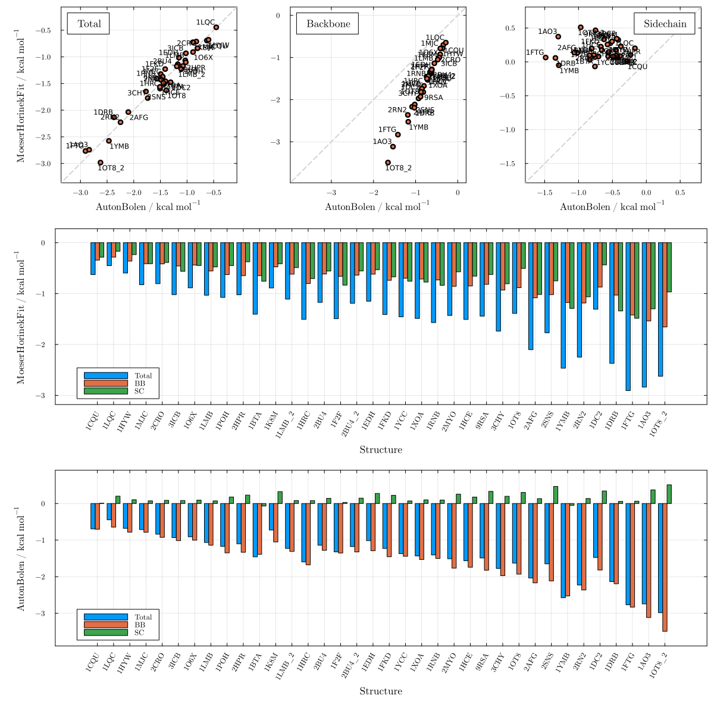
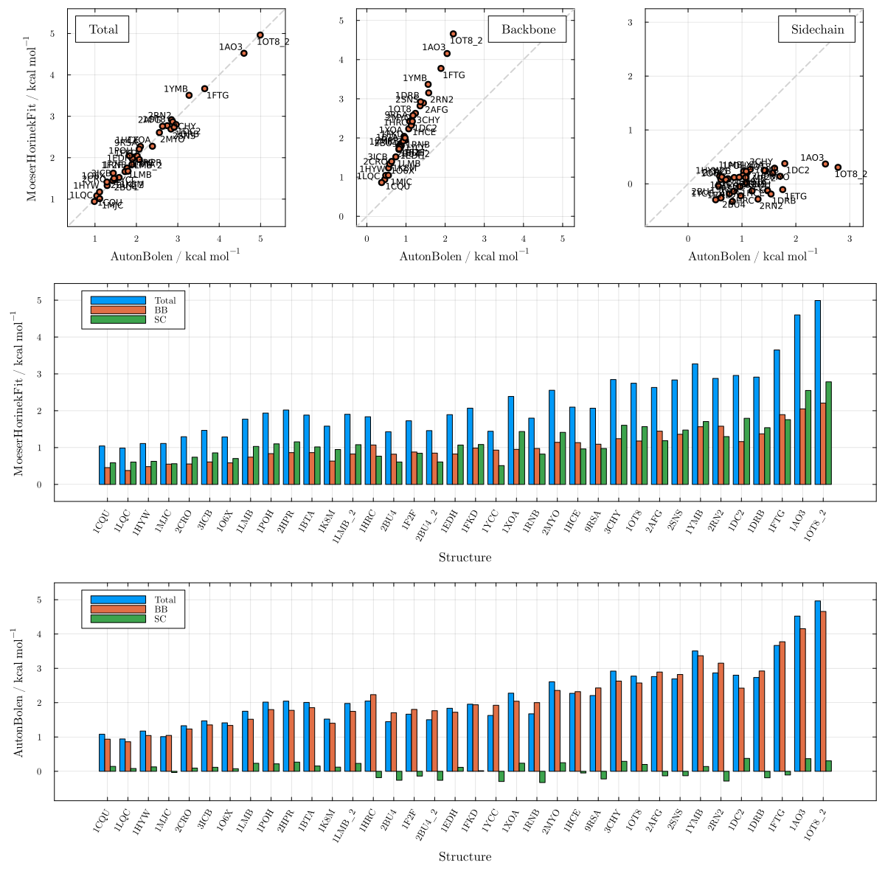
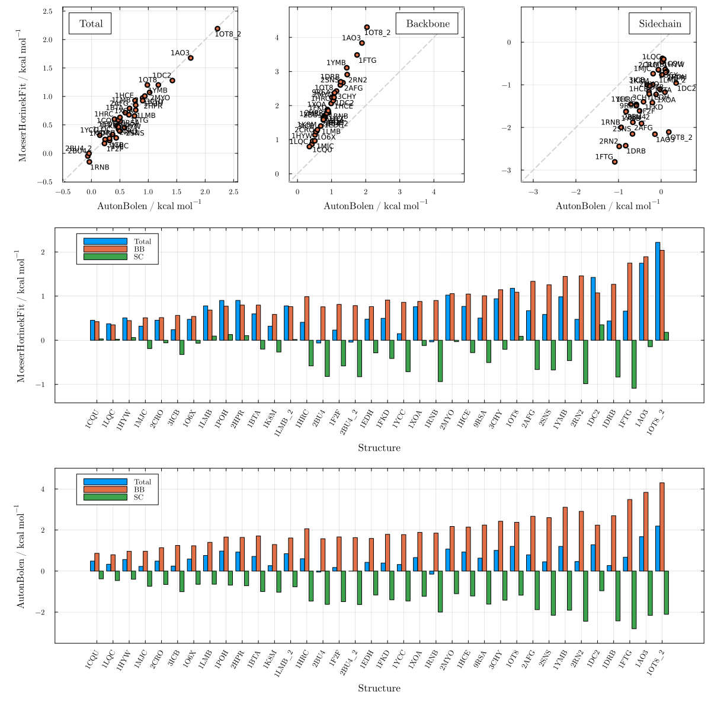
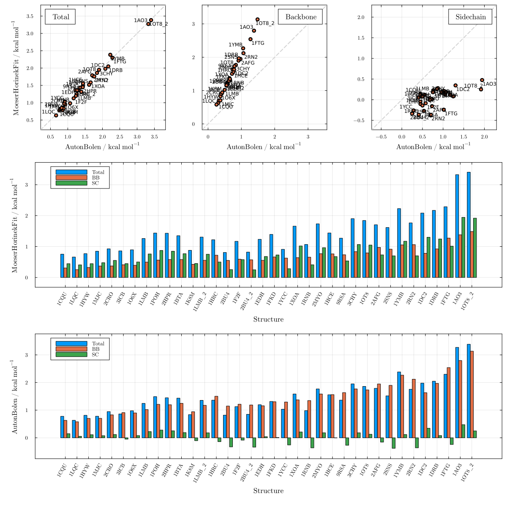
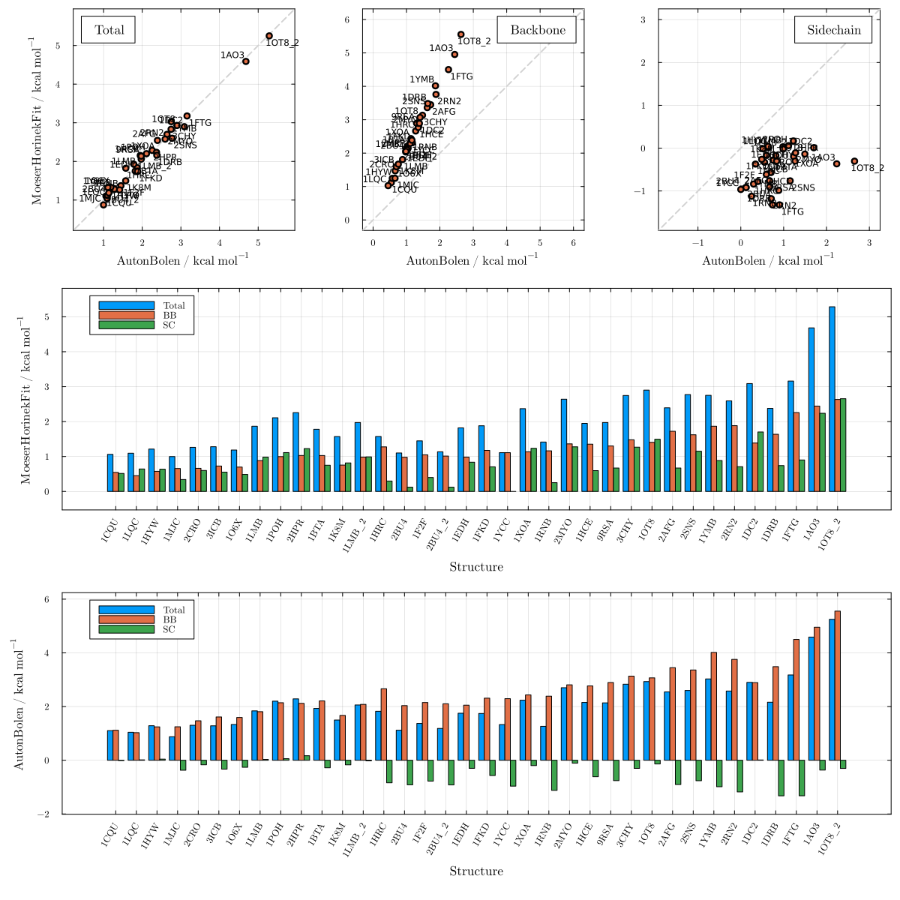
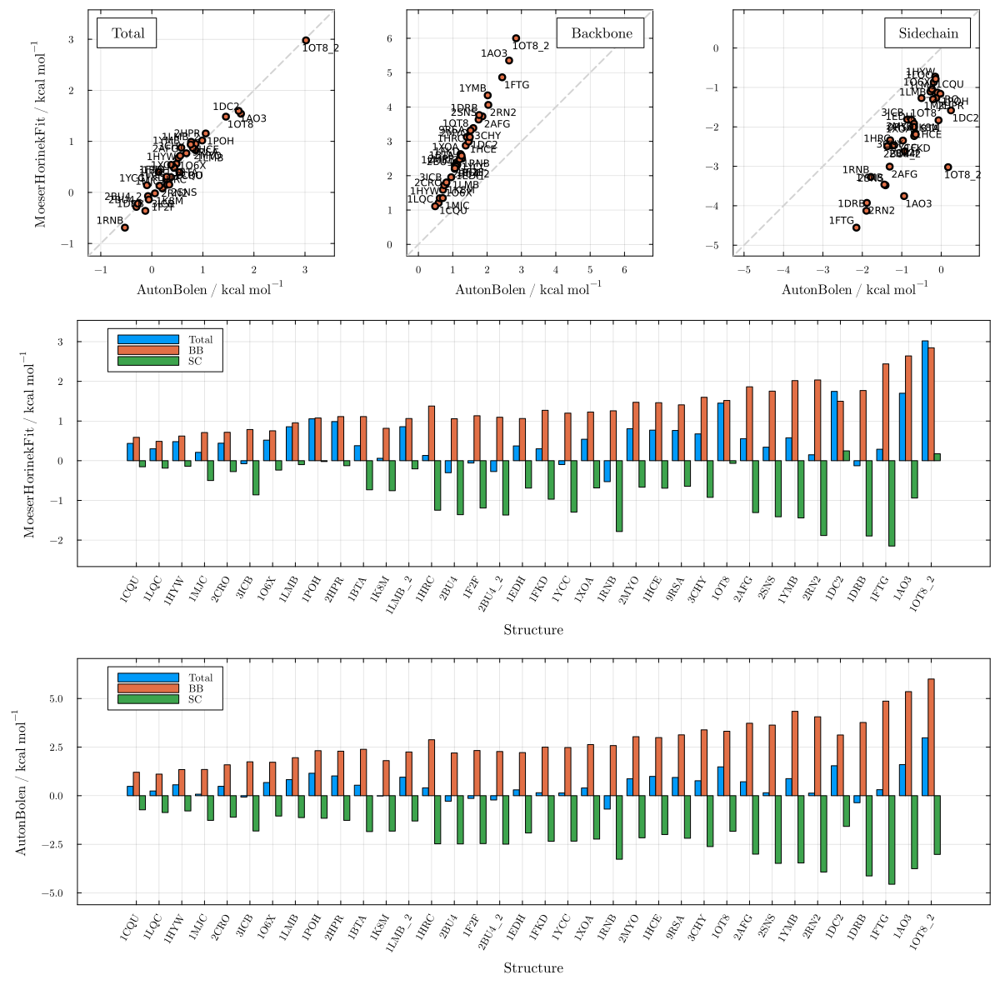
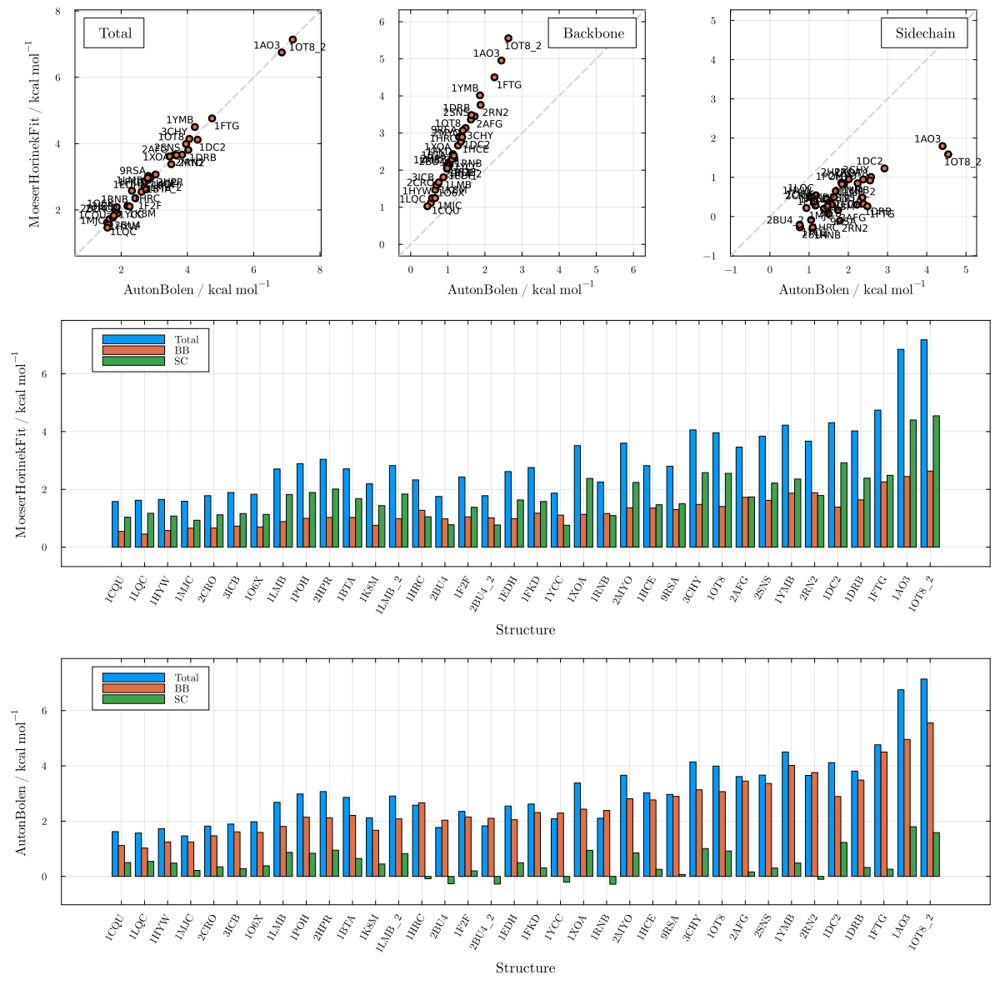

# Moeser & Horinek adjusted by Gly non-ideality

These plots show the novel MoeserHorinekFit model, which extends the MH glycine-activity correction to all cosolvents covered by the AB parameterization. For each cosolvent, a single correction constant $$\gamma$$ is fit so that MoeserHorinekFit total m-value predictions reproduce those of AutonBolen across 36 reference proteins, while retaining the MH universal backbone treatment. The fitted urea correction (≈15 cal mol⁻¹ M⁻¹) closely reproduces the theoretical Moeser–Horinek value, validating the approach. Comparisons against AutonBolen correspond to Figure 3 of the paper; fitted $$\gamma$$ values for all cosolvents are listed in Table 1 of the paper.

```julia
using LAPM, PDBTools
```

## Against Moeser & Horinek

### Urea — Figure S30

```julia
plot_MH_vs_AB("urea"; m1=MoeserHorinek, m2=MoeserHorinekFit)
```



## Against Auton & Bolen

### Urea — Figure S31

```julia
plot_MH_vs_AB("urea"; m1=AutonBolen, m2=MoeserHorinekFit)
```



### TMAO — Figure S32

```julia
plot_MH_vs_AB("tmao"; m1=AutonBolen, m2=MoeserHorinekFit)
```


### Sarcosine — Figure S33

```julia
plot_MH_vs_AB("sarcosine"; m1=AutonBolen, m2=MoeserHorinekFit)
```



### Proline — Figure S34

```julia
plot_MH_vs_AB("proline"; m1=AutonBolen, m2=MoeserHorinekFit)
```



### Sorbitol — Figure S35

```julia
plot_MH_vs_AB("sorbitol"; m1=AutonBolen, m2=MoeserHorinekFit)
```



### Sucrose — Figure S36

```julia
plot_MH_vs_AB("sucrose"; m1=AutonBolen, m2=MoeserHorinekFit)
```



### Betaine — Figure S37

```julia
plot_MH_vs_AB("betaine"; m1=AutonBolen, m2=MoeserHorinekFit)
```



### Glycerol — Figure S38

```julia
plot_MH_vs_AB("glycerol"; m1=AutonBolen, m2=MoeserHorinekFit)
```


### Trehalose — Figure S39

```julia
plot_MH_vs_AB("trehalose"; m1=AutonBolen, m2=MoeserHorinekFit)
```


