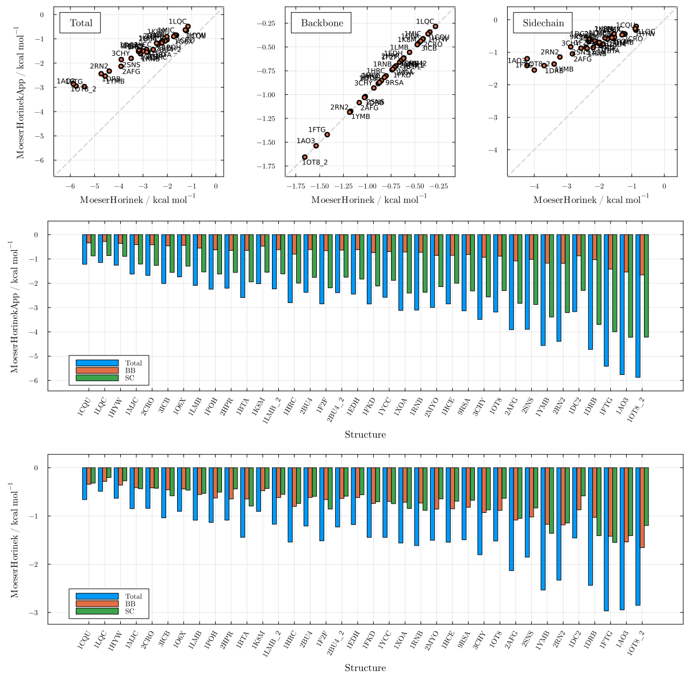
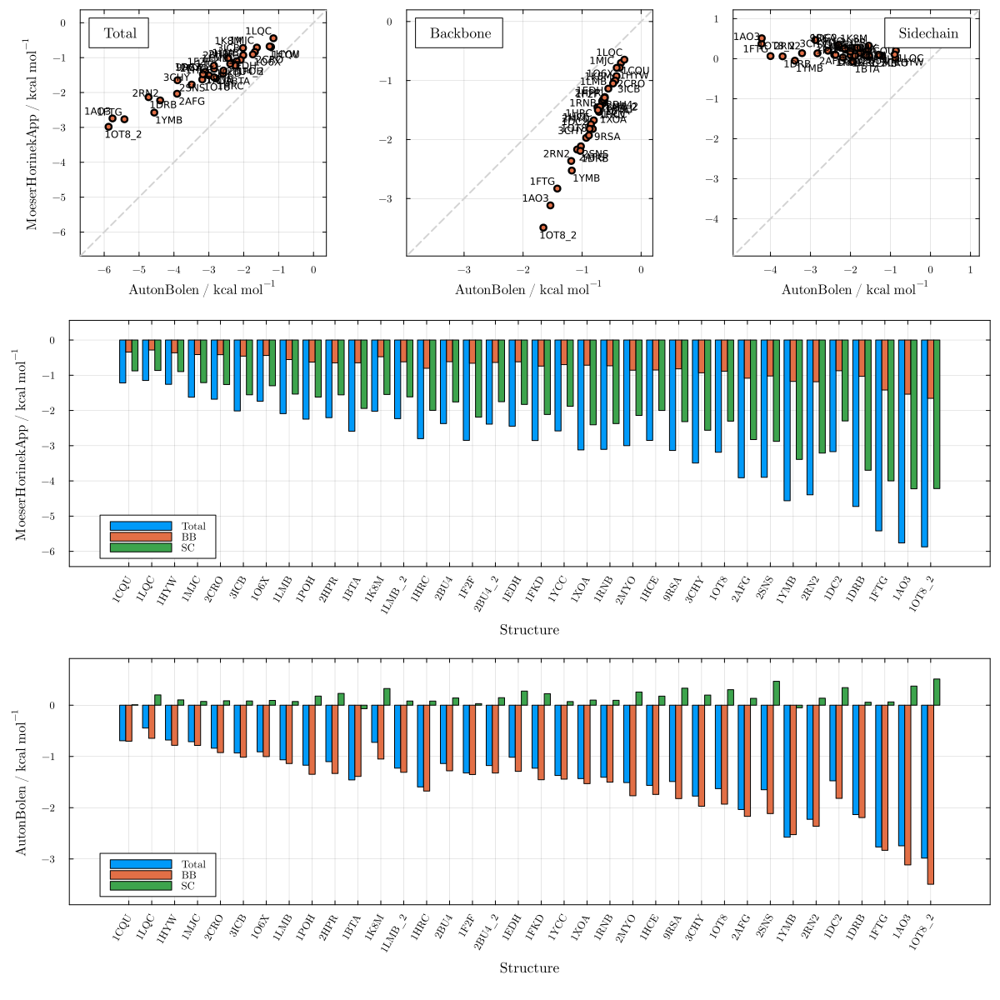
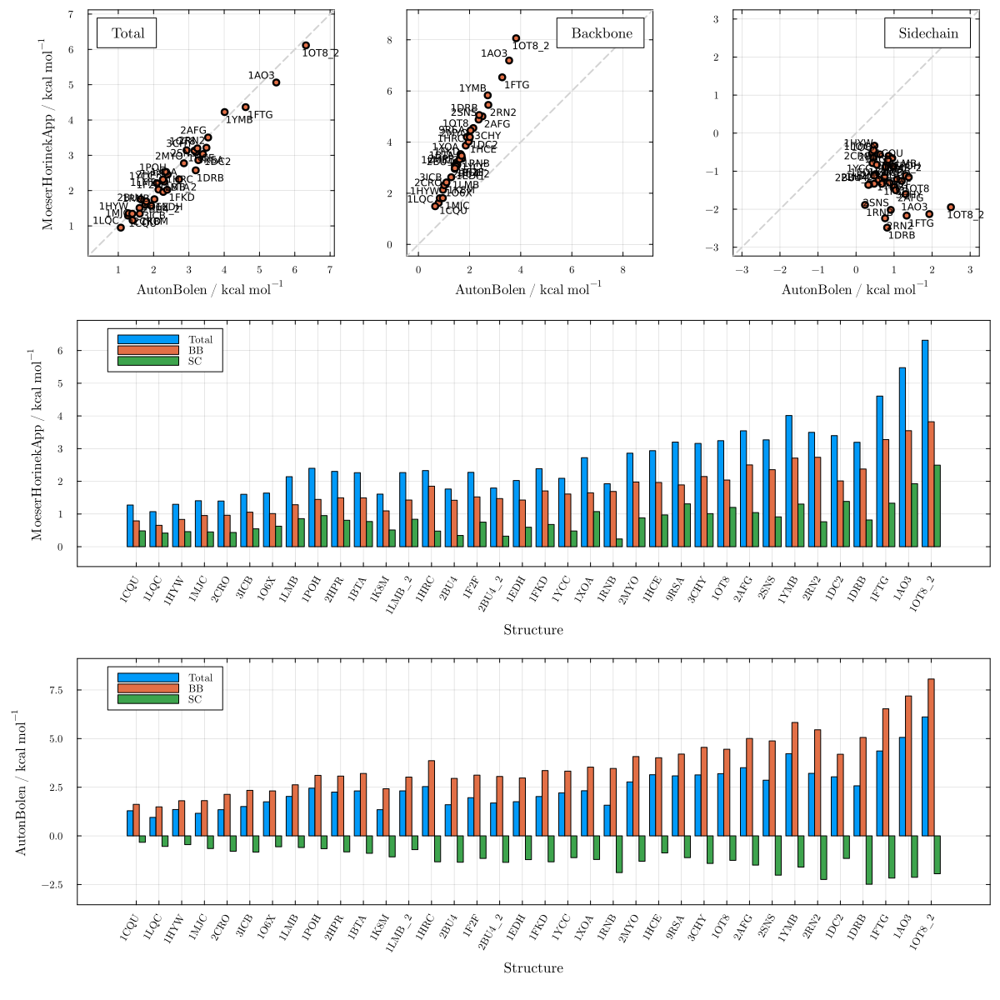
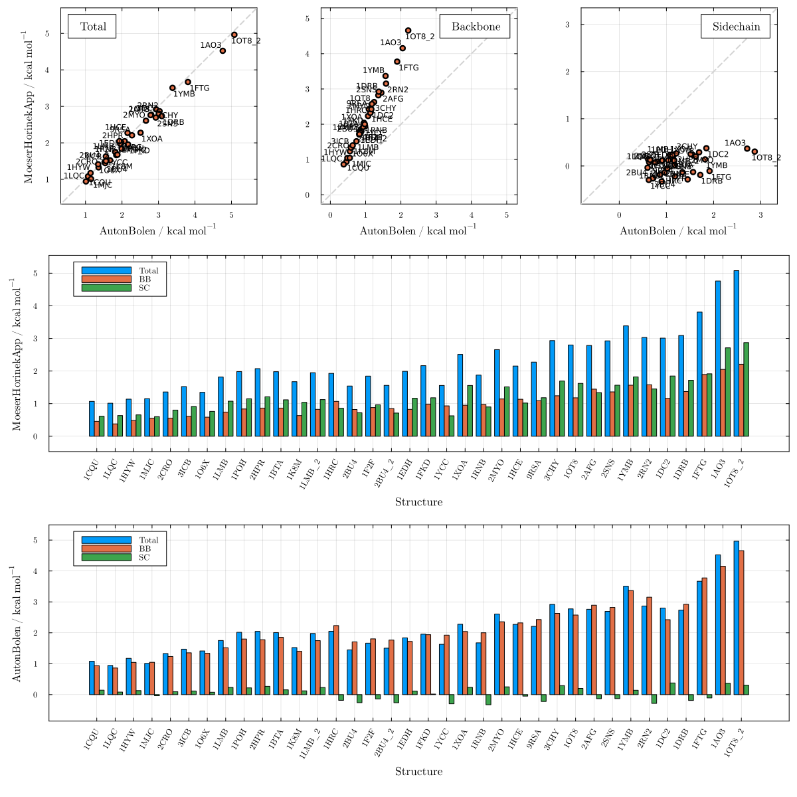
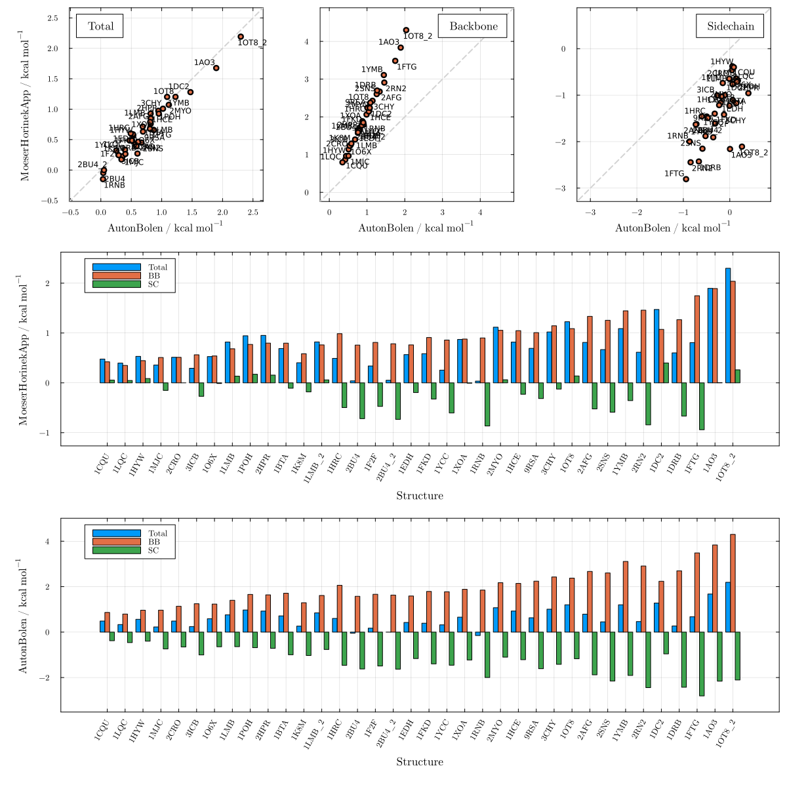
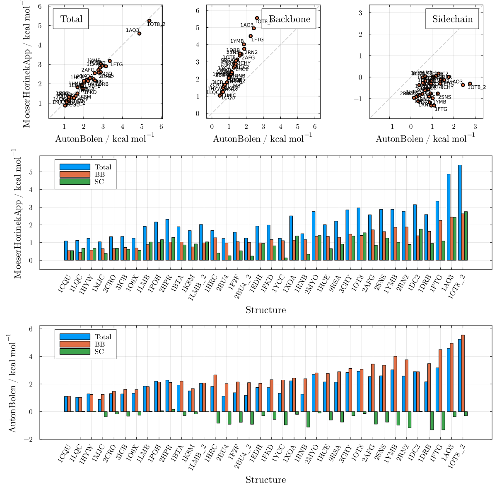
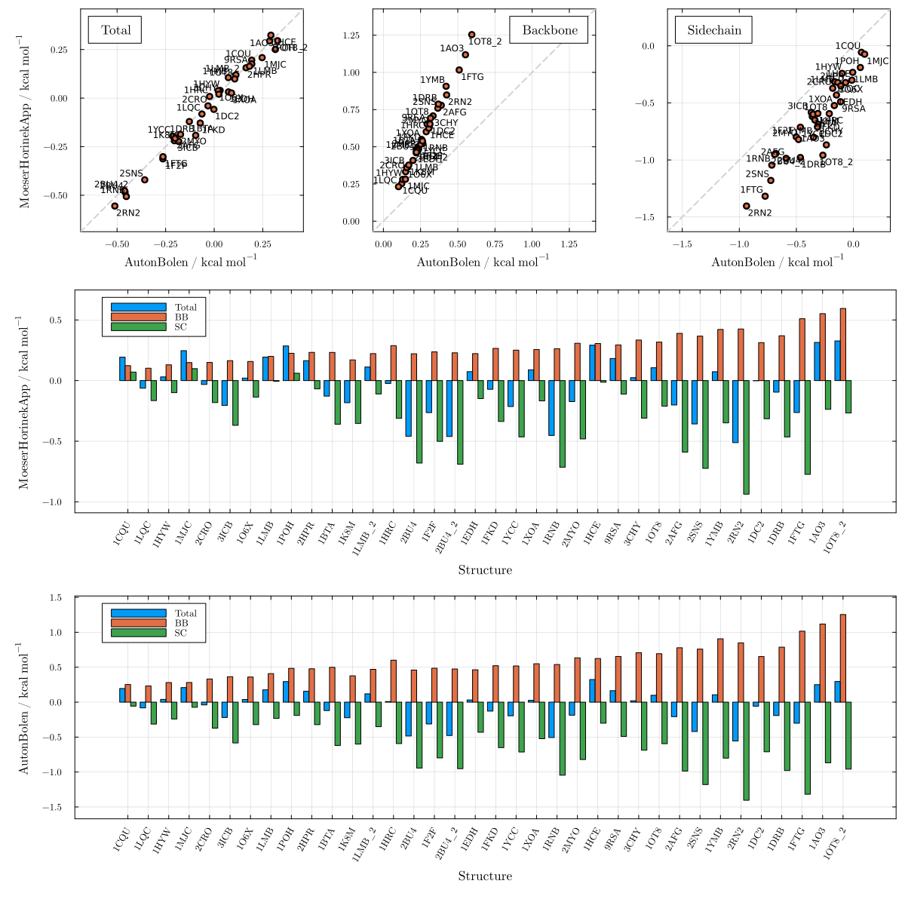
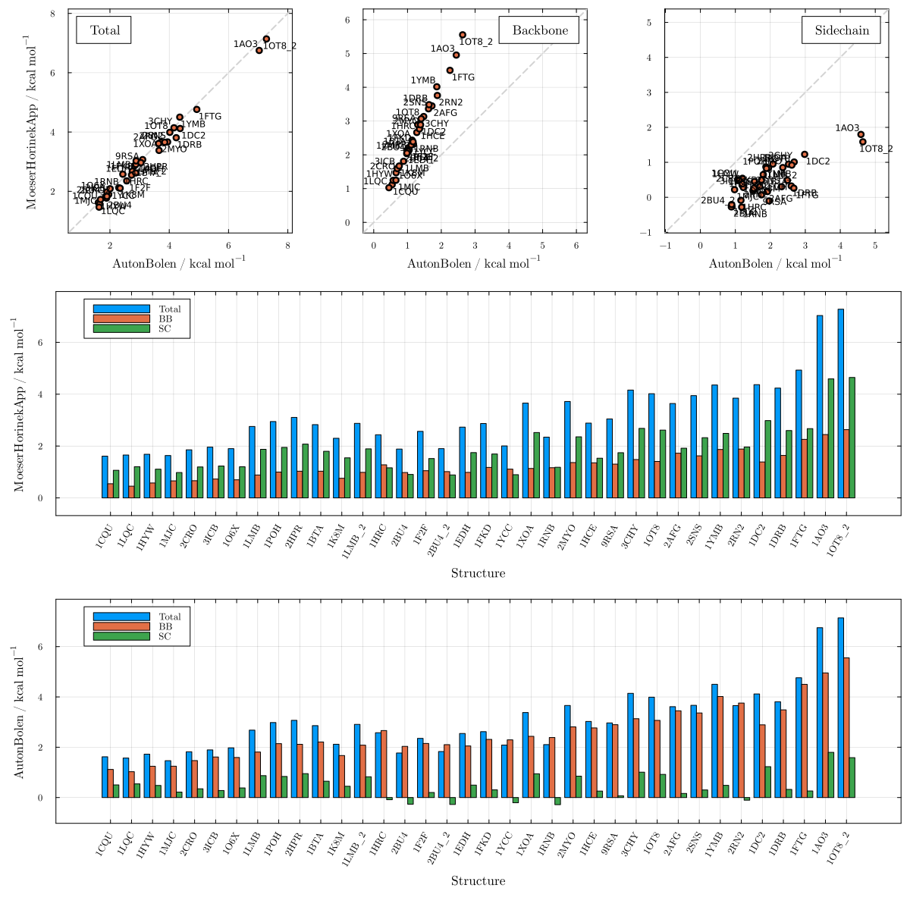

# Moeser & Horinek adjusted by Gly non-ideality

These plots show the MoeserHorinekApp model, which extends the MH to all cosolvents covered by the AB parameterization. Comparisons against AutonBolen correspond to Figure 3 of the paper.

```julia
using LAPM, PDBTools
```

## Against Moeser & Horinek

### Urea — Figure S32

```julia
plot_MH_vs_AB("urea"; m1=MoeserHorinek, m2=MoeserHorinekApp)
```



## Against Auton & Bolen

### Urea — Figure S33

```julia
plot_MH_vs_AB("urea"; m1=AutonBolen, m2=MoeserHorinekApp)
```



### TMAO — Figure S34

```julia
plot_MH_vs_AB("tmao"; m1=AutonBolen, m2=MoeserHorinekApp)
```



### Sarcosine — Figure S35

```julia
plot_MH_vs_AB("sarcosine"; m1=AutonBolen, m2=MoeserHorinekApp)
```



### Proline — Figure S36

```julia
plot_MH_vs_AB("proline"; m1=AutonBolen, m2=MoeserHorinekApp)
```



### Sorbitol — Figure S37

```julia
plot_MH_vs_AB("sorbitol"; m1=AutonBolen, m2=MoeserHorinekApp)
```


### Sucrose — Figure S38

```julia
plot_MH_vs_AB("sucrose"; m1=AutonBolen, m2=MoeserHorinekApp)
```



### Betaine — Figure S39

```julia
plot_MH_vs_AB("betaine"; m1=AutonBolen, m2=MoeserHorinekApp)
```


### Glycerol — Figure S40

```julia
plot_MH_vs_AB("glycerol"; m1=AutonBolen, m2=MoeserHorinekApp)
```



### Trehalose — Figure S41

```julia
plot_MH_vs_AB("trehalose"; m1=AutonBolen, m2=MoeserHorinekApp)
```


