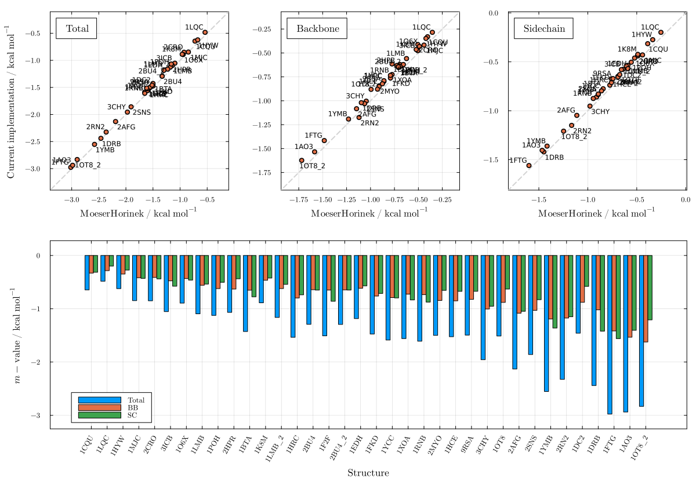
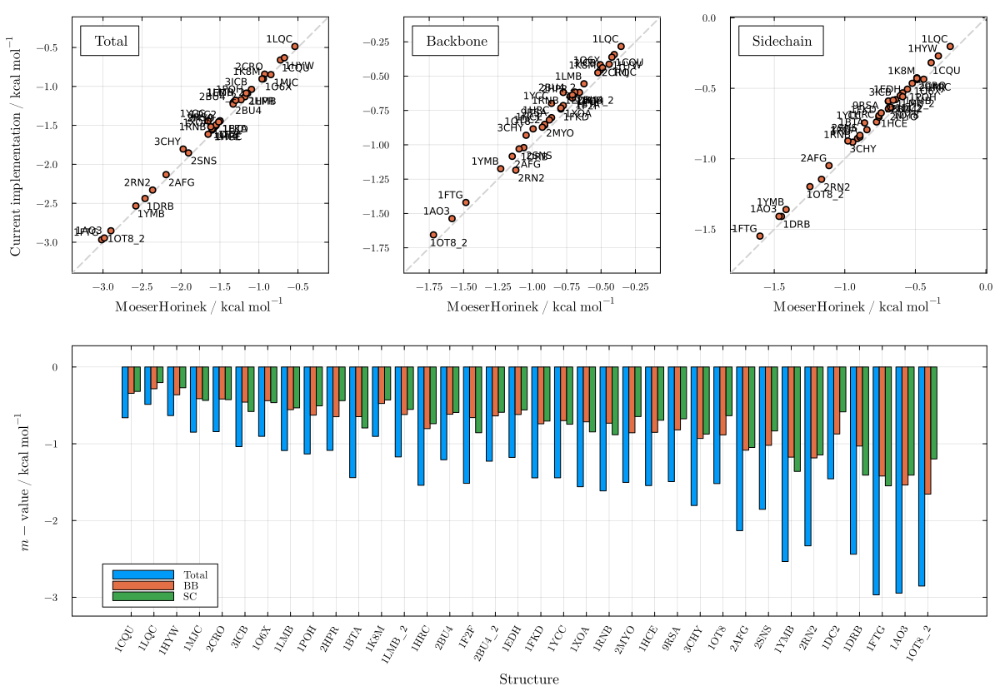

# Moeser & Horinek

These plots show m-value predictions using the Moeser & Horinek (MH) model for urea-induced protein denaturation. The MH model applies a glycine-activity correction to the side-chain group transfer free energies and introduces a universal backbone treatment — a single backbone transfer free energy per unit area for all residue types, normalized by the backbone SASA of glycine in an isolated Gly-X-Gly tripeptide. As originally parameterized, the MH model covers only urea.

```julia
using LAPM
```

## Urea (Creamer) — Figure S26

```julia
plot_mvalue(MoeserHorinek, "urea")
```



## Urea (Server) — Figure S27

```julia
plot_mvalue(MoeserHorinek, "urea"; sasas_from=LAPM.server_sasa)
```


